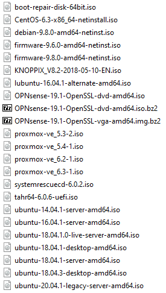
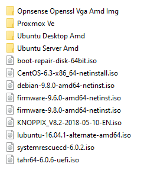
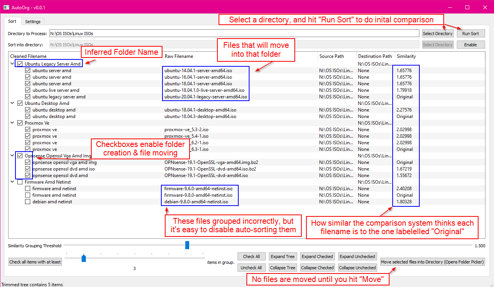

# AutoOrg

Do you have lots of unsorted files? Do they group into similar name clusters?

If so, AutoOrg may be the tool for you!

This is a tool that does heuristic sorting of files by similar names into appropriately named directories. It can also sort files into already existing folders as well.

Turn  into  with 5 clicks.

